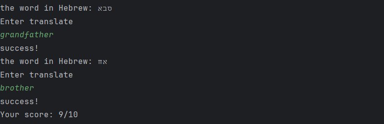

#LearnLang
Program that helps practice words in a new language.
It prints words to the user, and he has to translate them. The words must be entered in advance in the code.
modify word lists (original - lines 19 - 28, new - lines 39 -48.), and modify langs names. (appears several times in the code. You can replace using "search and replace", in the original code Hebrew and English languages are used).

